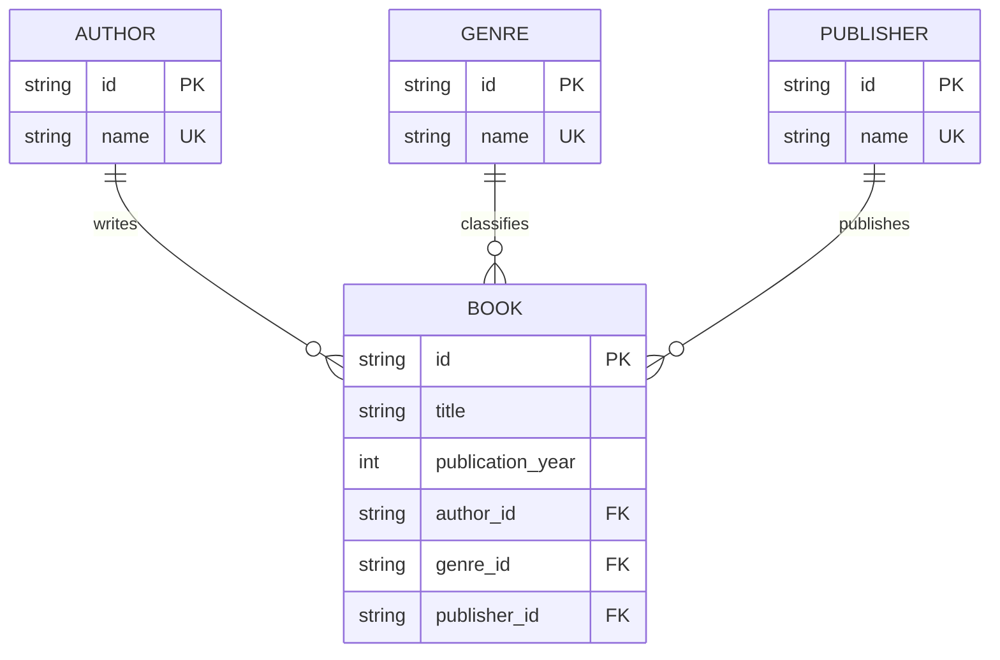

# ElectroLibrary

ElectroLibrary — мини-приложение для управления коллекцией книг.

Система позволяет создавать, просматривать, изменять и удалять книги, авторов,
жанры и издательства. Список книг поддерживает фильтрацию, поиск, сортировку и
пагинацию.

## Технологии

- Python 3.13
- FastAPI
- Vue 3
- Vue Router
- CouchDB
- Redis
- Docker Compose
- Pytest

## Архитектура

```text
HTTP-клиент
    |
    v
FastAPI Router
    |
    v
Service
    |
    +------> Redis
    |
    v
Repository
    |
    v
CouchDB
```

Router принимает HTTP-запросы. Service содержит бизнес-правила, проверяет связи
и управляет кешем. Repository выполняет запросы к CouchDB.

CouchDB является единственным постоянным хранилищем. Redis используется только
для кеширования готовых ответов списка книг и не сохраняет кеш на диск.

## Предметная область

В системе используются четыре сущности:

- книга;
- автор;
- жанр;
- издательство.

Каждая книга связана ровно с одним автором, одним жанром и одним издательством.
Один автор, жанр или издательство может быть связан с несколькими книгами.

## ER-диаграмма

Диаграмма отражает логическую нормализованную модель данных:



## Нормализация

Ненормализованное представление книги могло бы хранить связанные данные прямо
в одной записи:

```text
Book(id, title, publication_year, author_name, genre_name, publisher_name)
```

Такая модель приводит к дублированию имён и аномалиям обновления. Например,
переименование автора потребовало бы изменения всех его книг.

После нормализации данные разделены:

```text
Author(id, name)
Genre(id, name)
Publisher(id, name)
Book(id, title, publication_year, author_id, genre_id, publisher_id)
```

Логическая модель соответствует третьей нормальной форме:

- 1НФ: каждое поле содержит атомарное значение;
- 2НФ: неключевые поля полностью зависят от первичного ключа;
- 3НФ: отсутствуют транзитивные зависимости между неключевыми полями.

CouchDB не поддерживает внешние ключи, поэтому существование связей и запрет
удаления используемых справочников проверяет сервер.

## Документы CouchDB

Все документы хранятся в одной базе `electrolibrary` и различаются полем
`type`.

Книга:

```json
{
  "_id": "book:<uuid>",
  "type": "book",
  "title": "Мастер и Маргарита",
  "title_key": "мастер и маргарита",
  "publication_year": 1967,
  "author_id": "author:<uuid>",
  "genre_id": "genre:<uuid>",
  "publisher_id": "publisher:<uuid>"
}
```

Автор, жанр и издательство имеют одинаковую структуру:

```json
{
  "_id": "author:<uuid>",
  "type": "author",
  "name": "Михаил Булгаков",
  "name_key": "михаил булгаков"
}
```

Поля `title_key` и `name_key` используются для поиска, сортировки и проверки
уникальности без учёта регистра.

## API

Базовый путь API: `/api/v1`.

Для книг доступны:

```text
GET    /api/v1/books
GET    /api/v1/books/{book_id}
POST   /api/v1/books
PUT    /api/v1/books/{book_id}
DELETE /api/v1/books/{book_id}
```

Параметры `GET /api/v1/books`:

| Параметр | Назначение |
|---|---|
| `author_id` | Фильтр по автору |
| `genre_id` | Фильтр по жанру |
| `publisher_id` | Фильтр по издательству |
| `year` | Фильтр по году |
| `search` | Поиск по названию |
| `sort` | `title` или `publication_year` |
| `order` | `asc` или `desc` |
| `limit` | Размер страницы от 1 до 100 |
| `bookmark` | Указатель следующей страницы CouchDB |

Для справочников доступен одинаковый CRUD:

```text
/api/v1/authors
/api/v1/genres
/api/v1/publishers
```

Полная интерактивная документация API доступна через Swagger.

## Redis

Для списка книг используется паттерн Cache-Aside:

1. Сервер формирует ключ из версии кеша и параметров запроса.
2. При наличии значения готовый ответ возвращается из Redis.
3. При отсутствии значения данные загружаются из CouchDB и сохраняются в Redis.
4. После изменения книги или справочника версия кеша увеличивается.
5. Старые ключи удаляются автоматически после истечения TTL.

Недоступность Redis не блокирует API. В этом случае данные читаются напрямую из
CouchDB.

Ошибки приложения возвращаются в едином формате:

```json
{
  "detail": {
    "code": "ENTITY_NOT_FOUND",
    "message": "Книга не найдена"
  }
}
```

При недоступной CouchDB API возвращает `503 DATABASE_UNAVAILABLE`. Конфликт
ревизий CouchDB возвращается как `409 REVISION_CONFLICT`.

## Запуск

```bash
cp .env.example .env
docker compose up --build
```

После запуска доступны:

- Приложение: `http://localhost:3000`
- API: `http://localhost:8000`
- Swagger: `http://localhost:8000/docs`
- CouchDB Fauxton: `http://localhost:5984/_utils/`

Остановка:

```bash
docker compose down
```

Команда `docker compose down -v` дополнительно удаляет данные CouchDB.

## Тесты

Интеграционные тесты используют отдельные CouchDB и Redis и не изменяют рабочие
данные:

```bash
docker compose -f docker-compose.test.yml up --build --abort-on-container-exit --exit-code-from tests
docker compose -f docker-compose.test.yml down
```

Проверяются CRUD-операции, валидация, целостность связей, фильтрация, сортировка,
пагинация и инвалидация Redis-кеша.
